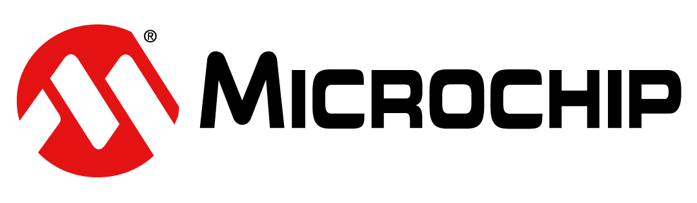
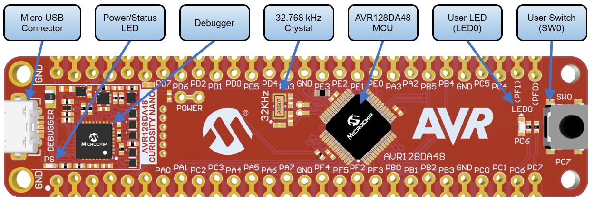

# Basic Bootloader for the AVR-DA Family

This repository contains the project source code for a basic bootloader compatible with AVR-DA family and the scripts used to upload the application image into the microcontroller's memory.

This repository contains:
* One Atmel Studio solution composed of two projects (Bootloader and HostApp);

## Required Tools
- Atmel Studio 7.0.2397 or newers
- AVR-Dx 1.0.18 or newer Device Pack
- AVR GCC compiler
- AVR128DA48 Curiosity Nano (DM164151)

## Instructions
In order to upload the application image follow this steps:
- Connect the board to the PC.
- Clean and build the two projects.
- Program *AVR-Dx_Bootloader* on the board.
- Browse to *scripts* folder and open *SerialUpload.bat* file. The python command has the following format: `python AVR-DA_uploader.py {path_to_hex_file} {flash_max_size} {COM_port} {baud_rate}`.
- Replace {path_to_hex_file}, {flash_max_size}, {COM_port}, {baud_rate} fields with their actual values and save the file.
- Run *SerialUpload.bat*.

Note:
- for the current implementation, baud rate for serial communication is configured in code as 9600.

## Compatibility
The source code is compatible with the following devices: AVR128DA28, AVR128DA32, AVR128DA48, and AVR128DA64.
